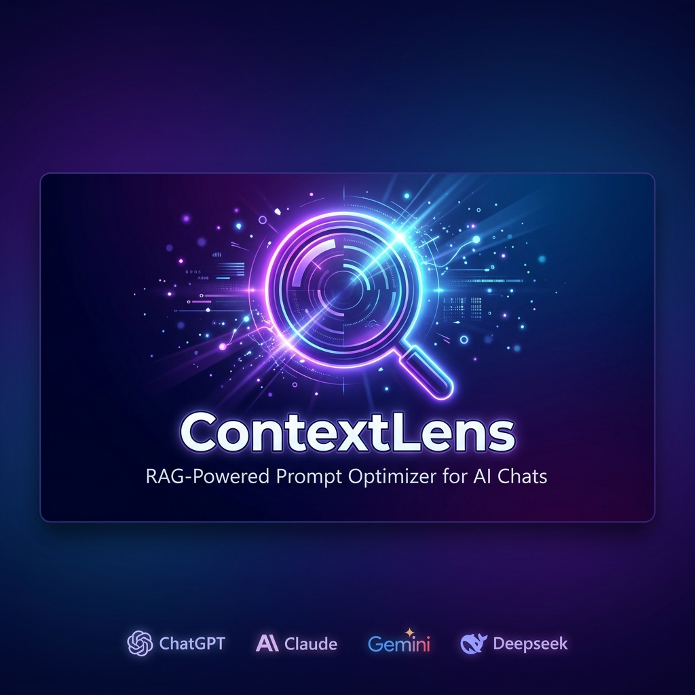
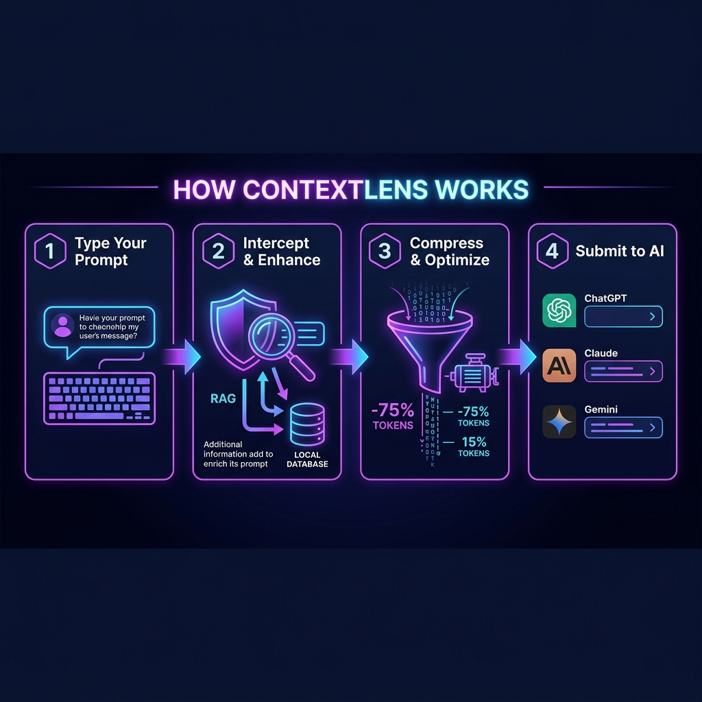
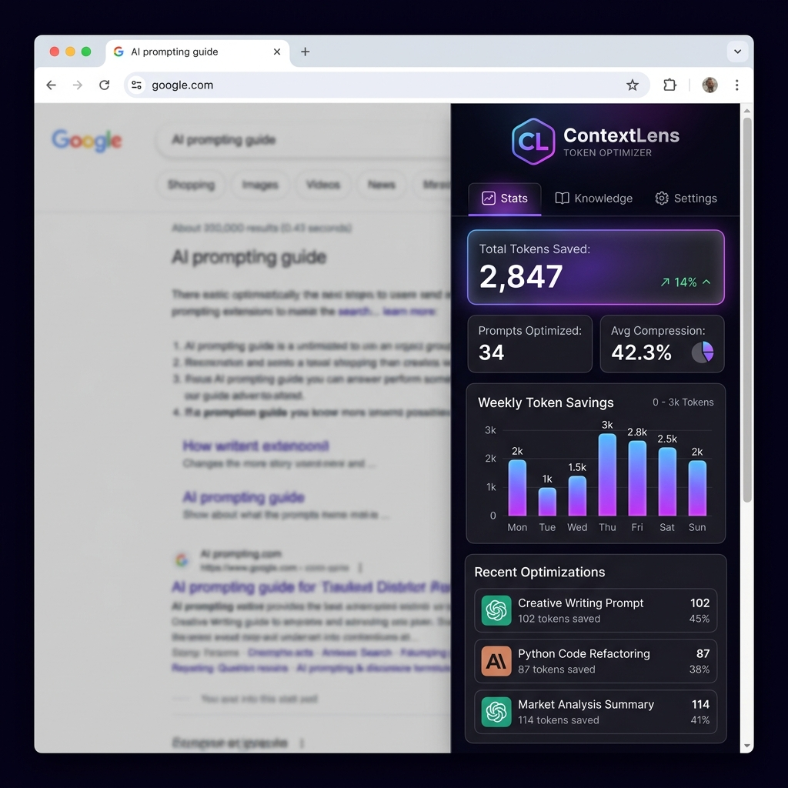
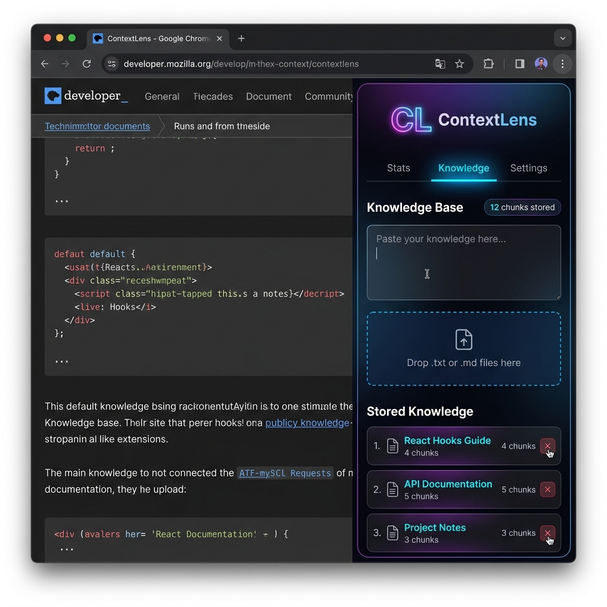
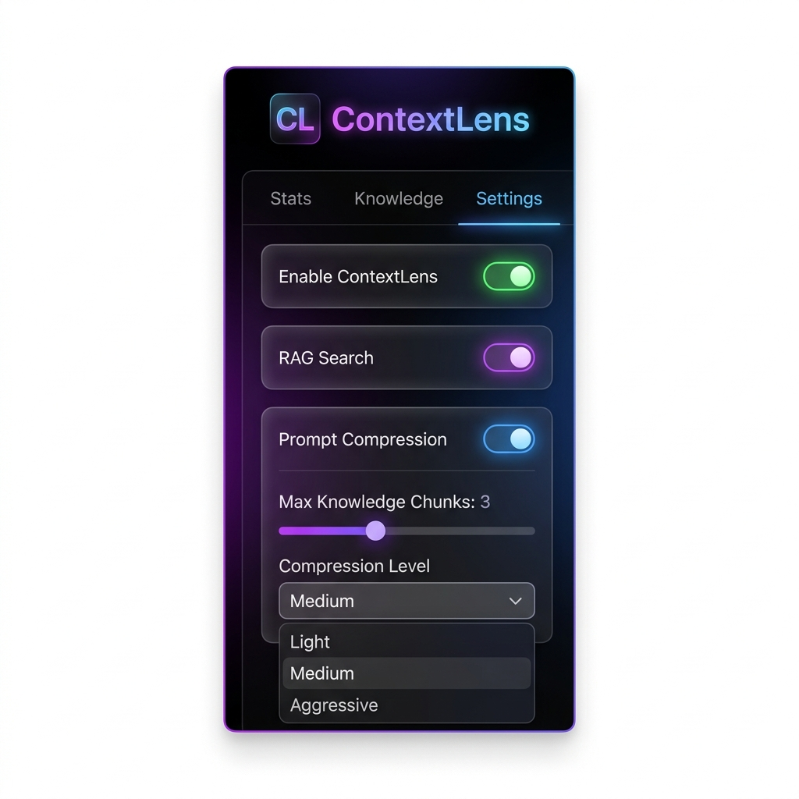

<p align="center">
  
</p>

<h1 align="center">🔍 ContextLens</h1>

<p align="center">
  <strong>RAG-Powered Prompt Optimizer for AI Chat Platforms</strong>
</p>

<p align="center">
  <a href="#-installation"></a>
  <a href="#-tech-stack"></a>
  <a href="#-privacy--security"></a>
  <a href="./LICENSE"></a>
</p>

<p align="center">
  <em>Intercepts your AI chat prompts, enriches them with local knowledge, compresses tokens — all before submission. Zero API keys. 100% local.</em>
</p>

---

## 📋 Table of Contents

- [Why ContextLens?](#-why-contextlens)
- [Key Benefits](#-key-benefits)
- [How It Works](#-how-it-works)
- [Screenshots](#-screenshots)
- [Supported Platforms](#-supported-platforms)
- [Installation](#-installation)
- [Development Setup](#-development-setup)
- [Project Structure](#-project-structure)
- [Tech Stack](#-tech-stack)
- [Testing](#-testing)
- [Privacy & Security](#-privacy--security)
- [Contributing](#-contributing)
- [License](#-license)

---

## 🤔 Why ContextLens?

Every time you type a prompt into ChatGPT, Claude, or Gemini, you're burning tokens on filler words, redundant phrases, and missing context. **ContextLens fixes this automatically.**

| Problem | ContextLens Solution |
|---------|---------------------|
| 🔥 Hitting token/context limits | Heuristic compression removes 40-70% of noise |
| 📚 Repeating the same context every prompt | Local RAG auto-retrieves relevant knowledge |
| 💰 Paying for wasted tokens on API-based plans | Fewer tokens = lower costs |
| 🔒 Privacy concerns with cloud tools | Everything runs 100% locally in your browser |
| ⏱️ Manually optimizing prompts | Fully automatic — just type and send |

---

## ✨ Key Benefits

### 🚀 Save 40-70% Tokens Automatically
ContextLens strips filler phrases, verbose openers, and redundant wording from your prompts without losing meaning. Your intent stays intact — the fluff disappears.

### 🧠 Local RAG-Powered Context Injection
Upload your documentation, notes, or code snippets into the built-in Knowledge Base. ContextLens automatically retrieves the most relevant chunks and prepends them to your prompts — making your AI conversations smarter without manual copy-pasting.

### 🔒 100% Privacy — Zero Cloud Dependencies
All vector embeddings and text processing happen **entirely in your browser** using ONNX Runtime (WASM). No data is ever sent to external servers. Your knowledge stays yours.

### ⚡ Works Across 10+ AI Platforms
One extension, all platforms. ContextLens supports Claude, ChatGPT, Gemini, DeepSeek, Perplexity, Microsoft Copilot, Meta AI, HuggingFace Chat, Poe, and more with a generic fallback adapter.

### 📊 Real-Time Analytics Dashboard
Track your token savings, compression ratios, and optimization history in a beautiful glassmorphic side panel — see exactly how much ContextLens saves you.

---

## 🔧 How It Works

<p align="center">
  
</p>

ContextLens operates as a transparent middleware between your keyboard and the AI platform:

```
You type a prompt into ChatGPT / Claude / Gemini / DeepSeek
                    ↓
    ┌─────────────────────────────────┐
    │  1. INTERCEPT                   │
    │  Content script captures your   │
    │  prompt before submission       │
    └──────────────┬──────────────────┘
                   ↓
    ┌─────────────────────────────────┐
    │  2. RAG RETRIEVAL               │
    │  Embeds your prompt locally     │
    │  (ONNX/WASM), searches your    │
    │  IndexedDB knowledge base,     │
    │  retrieves top-3 relevant       │
    │  chunks via cosine similarity   │
    └──────────────┬──────────────────┘
                   ↓
    ┌─────────────────────────────────┐
    │  3. COMPRESS & OPTIMIZE         │
    │  Strips filler phrases,         │
    │  consolidates whitespace,       │
    │  removes stopwords              │
    │  (Light / Medium / Aggressive)  │
    └──────────────┬──────────────────┘
                   ↓
    ┌─────────────────────────────────┐
    │  4. SUBMIT TO AI                │
    │  Injects optimized prompt back  │
    │  into the textarea, dispatches  │
    │  synthetic events, submits      │
    └─────────────────────────────────┘
                   ↓
        AI receives a leaner, richer prompt
```

### Architecture Diagram

<p align="center">
  
</p>

---

## 📸 Screenshots

<table>
  <tr>
    <td align="center"><strong>📊 Stats Dashboard</strong></td>
    <td align="center"><strong>📚 Knowledge Base</strong></td>
    <td align="center"><strong>⚙️ Settings</strong></td>
  </tr>
  <tr>
    <td></td>
    <td></td>
    <td></td>
  </tr>
  <tr>
    <td><em>Track tokens saved, compression ratios, and optimization history in real-time</em></td>
    <td><em>Upload docs, paste text, manage your local knowledge chunks</em></td>
    <td><em>Toggle RAG, compression levels, and configure pipeline behavior</em></td>
  </tr>
</table>

---

## 🌐 Supported Platforms

| Platform | URL | Adapter Type |
|----------|-----|-------------|
| **ChatGPT** | chat.openai.com / chatgpt.com | Dedicated |
| **Claude** | claude.ai | Dedicated |
| **Gemini** | gemini.google.com | Dedicated |
| **DeepSeek** | chat.deepseek.com | Dedicated |
| **Perplexity** | perplexity.ai | Generic |
| **Microsoft Copilot** | copilot.microsoft.com | Generic |
| **Meta AI** | meta.ai | Generic |
| **HuggingFace Chat** | huggingface.co/chat | Generic |
| **Poe** | poe.com | Generic |

> 💡 The generic adapter works on **any AI chat site** that uses standard `textarea` or `contenteditable` inputs.

---

## 📦 Installation

### Option 1: Install from Source (Recommended)

#### Prerequisites
- **Node.js 18+** — [Download here](https://nodejs.org/)
- **Google Chrome** — Latest stable version

#### Step-by-Step Guide

**1. Clone the repository**
```bash
git clone https://github.com/jimon1139m/Contextlens.git
cd Contextlens
```

**2. Install dependencies**
```bash
npm install
```

**3. Build the extension**
```bash
npm run build
```
This compiles everything into the `/dist` directory.

**4. Load into Chrome**
1. Open Chrome and navigate to `chrome://extensions/`
2. Enable **Developer Mode** (toggle in the top-right corner)
3. Click **"Load unpacked"** button
4. Select the `dist/` folder inside the cloned project

**5. Verify installation**
- You should see **ContextLens** appear in your extensions list
- Click the ContextLens icon → Side panel opens with Stats/Knowledge/Settings tabs
- Navigate to any supported AI chat site → Open DevTools (F12) → Filter console for `[ContextLens]`
- You should see: `✅ Loaded adapter for chatgpt on chatgpt.com`

### Option 2: Direct CRX Install (Quick Test)

1. Download `contextlens.crx` from the [latest release](https://github.com/jimon1139m/Contextlens/releases)
2. Open `chrome://extensions/`
3. Drag and drop the `.crx` file onto the page
4. Confirm the installation

---

## 🛠️ Development Setup

```bash
# Clone and install
git clone https://github.com/jimon1139m/Contextlens.git
cd Contextlens
npm install

# Start development server (hot-reload popup UI)
npm run dev

# Build for production
npm run build

# Run unit tests
npm run test

# Run E2E tests
npm run test:e2e

# Lint code
npm run lint

# Package as .zip for Chrome Web Store
npm run package
```

---

## 📁 Project Structure

```
Contextlens/
├── public/
│   ├── manifest.json           # Chrome MV3 manifest
│   ├── favicon.svg             # Extension icon
│   └── icons.svg               # UI icons
├── src/
│   ├── background/
│   │   └── service-worker.ts   # Background message hub
│   ├── content/
│   │   ├── index.ts            # Content script entry point
│   │   └── adapters/
│   │       ├── chatgpt-adapter.ts
│   │       ├── claude-adapter.ts
│   │       ├── gemini-adapter.ts
│   │       ├── deepseek-adapter.ts
│   │       └── generic-adapter.ts
│   ├── popup/
│   │   ├── App.tsx             # Side panel main UI
│   │   ├── main.tsx            # React entry point
│   │   └── components/
│   │       ├── Stats.tsx       # Token savings dashboard
│   │       ├── KnowledgeBase.tsx # Knowledge management
│   │       └── Settings.tsx    # Extension configuration
│   ├── rag/
│   │   ├── embedder.ts         # Text → vector embedding (ONNX)
│   │   ├── vectorStore.ts      # IndexedDB vector storage
│   │   └── retriever.ts        # Cosine similarity search
│   ├── compressor/
│   │   ├── heuristicCompressor.ts  # Rule-based compression
│   │   └── historyTrimmer.ts       # Chat history management
│   ├── shared/
│   │   ├── types.ts            # TypeScript interfaces
│   │   └── utils.ts            # Utility functions
│   └── styles/
│       └── globals.css         # Global styles
├── tests/
│   ├── adapters.test.ts        # Adapter unit tests
│   ├── compressor.test.ts      # Compression engine tests
│   ├── vectorStore.test.ts     # Vector store tests
│   ├── utils.test.ts           # Utility function tests
│   ├── components.test.tsx     # React component tests
│   └── e2e/
│       └── extension.spec.ts   # Playwright E2E tests
├── screenshots/                # README images
├── package.json
├── vite.config.ts
├── tsconfig.json
├── tailwind.config.js
└── README.md
```

---

## 🏗️ Tech Stack

| Layer | Technology | Purpose |
|-------|-----------|---------|
| **Runtime** | Chrome Extension (Manifest V3) | Browser integration platform |
| **Frontend** | React 19 + TypeScript | Side panel UI with glassmorphic design |
| **Build** | Vite 8 + `vite-plugin-web-extension` | Fast builds with MV3 support |
| **Styling** | Tailwind CSS 3 | Utility-first responsive styling |
| **ML Inference** | `@xenova/transformers` (ONNX Runtime WASM) | Client-side text embeddings |
| **Vector Storage** | IndexedDB (custom wrapper) | Local persistent vector store |
| **Icons** | Lucide React | Clean, consistent iconography |
| **Unit Testing** | Vitest + Testing Library | Component and logic testing |
| **E2E Testing** | Playwright | Chrome extension integration tests |

---

## 🧪 Testing

### Unit Tests

Covers adapters, compression engines, vector store, utilities, and React components:

```bash
npm run test
```

**Test coverage includes:**
- ✅ Heuristic compressor (light/medium/aggressive levels)
- ✅ History trimmer (token budget enforcement)
- ✅ Vector store CRUD operations
- ✅ Text chunking and token estimation
- ✅ Site adapter detection logic
- ✅ React component rendering

### E2E Tests

Boots an isolated Chromium instance with the compiled extension to verify:

```bash
npm run test:e2e
```

- Extension loads without errors
- Side panel renders correctly
- Service worker registers and responds

---

## 🔒 Privacy & Security

ContextLens is designed with **privacy-first architecture**:

- ✅ **All processing is local** — No data leaves your browser
- ✅ **No API keys required** — ML models run via ONNX Runtime (WASM)
- ✅ **No external servers** — Vector embeddings stored in IndexedDB
- ✅ **No analytics/tracking** — Zero telemetry
- ✅ **Open source** — Fully auditable codebase
- ✅ **Minimal permissions** — Only requests access to supported AI chat domains

See [PRIVACY_POLICY.md](./PRIVACY_POLICY.md) for the full privacy policy.

---

## 🤝 Contributing

Contributions are welcome! Here's how to get started:

1. **Fork** the repository
2. **Create** your feature branch: `git checkout -b feature/amazing-feature`
3. **Commit** your changes: `git commit -m 'feat: add amazing feature'`
4. **Push** to the branch: `git push origin feature/amazing-feature`
5. **Open** a Pull Request

### Development Guidelines

- Follow existing code patterns and TypeScript conventions
- Write tests for new features
- Use Tailwind utility classes for styling
- Keep content script adapters lightweight
- Service workers are ephemeral — persist state to `chrome.storage` or IndexedDB

---

## 📄 License

This project is licensed under the MIT License — see the [LICENSE](./LICENSE) file for details.

---

<p align="center">
  <strong>Built with ❤️ by <a href="https://github.com/jimon1139m">jimon1139m</a></strong>
</p>

<p align="center">
  <em>If ContextLens saves you tokens, consider giving it a ⭐ on GitHub!</em>
</p>
