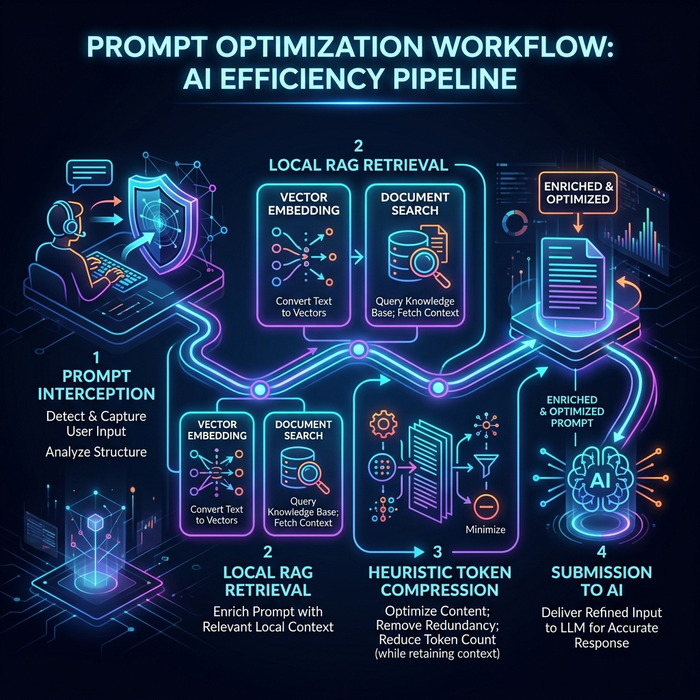
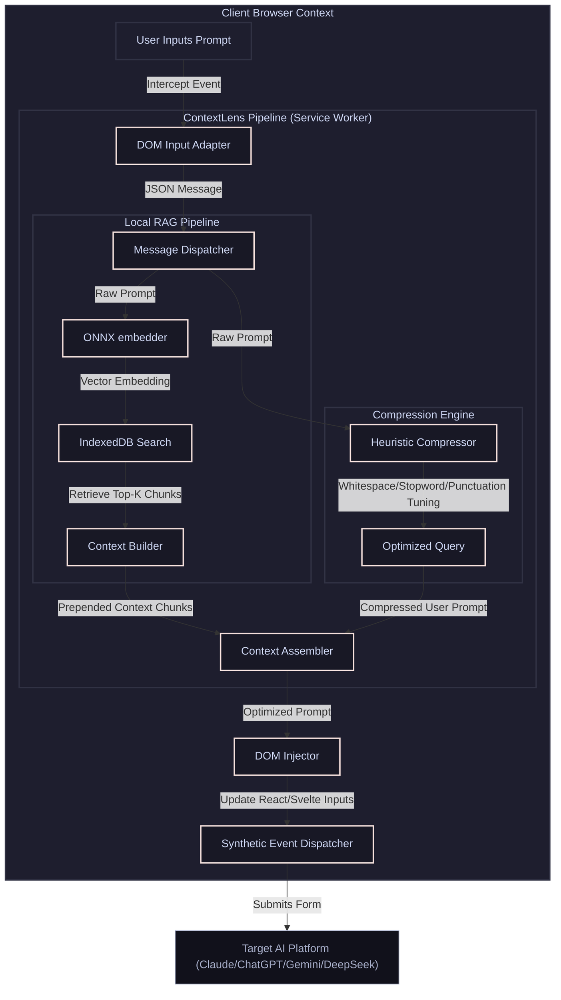

# 🔍 ContextLens: RAG-Powered Prompt Optimizer

ContextLens is a high-performance Chrome Extension (Manifest V3) that transparently intercepts prompts typed into major AI chat platforms (Claude, ChatGPT, Gemini, DeepSeek). It enhances prompts by running them through a local RAG (Retrieval-Augmented Generation) and token-compression pipeline before submission, maximizing context relevance while minimizing token costs.

---

## 🚀 Architectural Workflow

Here is how ContextLens processes your prompt instantly on the client side before it reaches the AI server:



### 📊 Workflow Pipeline



---

## 🎯 Core Features

### 1. Transparent Prompt Interception & Custom Adapters
ContextLens detects when you are on Claude, ChatGPT, Gemini, or DeepSeek and attaches a custom interceptor to the input `textarea` elements. When you press `Enter` or click the Send button, the extension intercepts the submit event, runs the optimization pipeline, updates the input value, and dispatches synthetic React/DOM events to guarantee smooth integration with modern frontend frameworks.

### 2. Local, High-Performance RAG Pipeline
* **ONNX Web Embedder:** Powered by `@xenova/transformers` with ONNX Runtime Web. It loads and runs the highly efficient `Xenova/all-MiniLM-L6-v2` model completely on the client side (under 25MB).
* **Local Vector Store:** Stores and searches knowledge blocks locally within `IndexedDB` with custom cosine similarity search logic.

### 3. Heuristic Token Compression Engine
Reduces token costs and optimizes prompt length by removing excess noise while preserving intent:
* **Whitespace & Linebreak Consolidation:** Compresses redundant spacing.
* **Stopword Filtering:** Removes optional grammatical noise (customizable by level).
* **History Trimming:** Optionally trims older chat logs/inputs to preserve the target AI's strict context window.

### 4. Cinematic Glassmorphism Popup UI
A beautiful sidebar panel designed with full glassmorphic aesthetics that allows you to:
* **Manage Knowledge:** Add text or web clippings directly to your local RAG database.
* **Configure Settings:** Enable/disable RAG, compression levels, and set prompt context limits.
* **Monitor Performance Stats:** Track total tokens saved and prompts optimized.

---

## 🛠️ Tech Stack & Constraints

* **Frontend:** Vite + React + TypeScript + Tailwind CSS
* **Extension API:** Chrome Extension Manifest V3 (ephemeral service worker execution, standard CSP security)
* **ML Inference:** `@xenova/transformers` (ONNX Runtime, WASM-powered execution)
* **Storage:** Chrome Sync Storage (settings), IndexedDB (knowledge vector chunks)
* **Testing:** Playwright (E2E headless browser integration tests), Vitest (unit & component testing)

---

## 🏁 Getting Started & Setup

### Prerequisites
* **Node.js:** Ensure Node.js 18+ is installed.
* **NPM:** Standard package manager.

### 1. Install Dependencies
```bash
npm install
```

### 2. Build the Extension
```bash
npm run build
```
This compiles the popup, content script, and service worker into the `/dist` directory.

### 3. Load into Google Chrome
1. Open Google Chrome and navigate to `chrome://extensions`.
2. Enable **Developer mode** in the top-right corner.
3. Click **Load unpacked** in the top-left corner.
4. Select the `/dist` folder inside your `Contextlens` project directory.

---

## 🧪 Testing Suites

ContextLens includes a complete test harness to ensure high-fidelity operations:

### Unit Tests (Vitest)
Unit tests cover adapters, compression engines, history trimmers, utility functions, and local vector stores:
```bash
npm run test
```

### E2E Chrome Extension Tests (Playwright)
E2E tests boot an isolated, headless Chromium context loaded with the compiled Manifest V3 extension to verify popup rendering and background service worker registration:
```bash
npm run test:e2e
```
